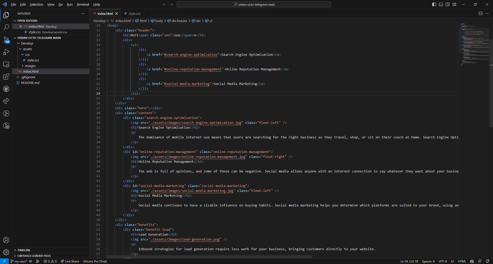
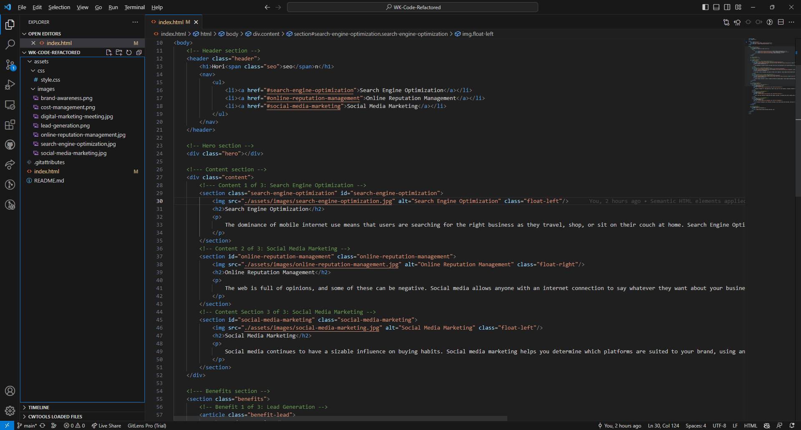

# Code Refactor Starter Code
Link to deployed application: https://warrenk0126.github.io/WK-Code-Refactored/
## Starter code

## Submitted Code

Semantic HTML elements have been added.
Structure had been reorganized based on logic and uniformity.
Alt attributes have been added.
Comments have been added.
Webpage title had been revised.
